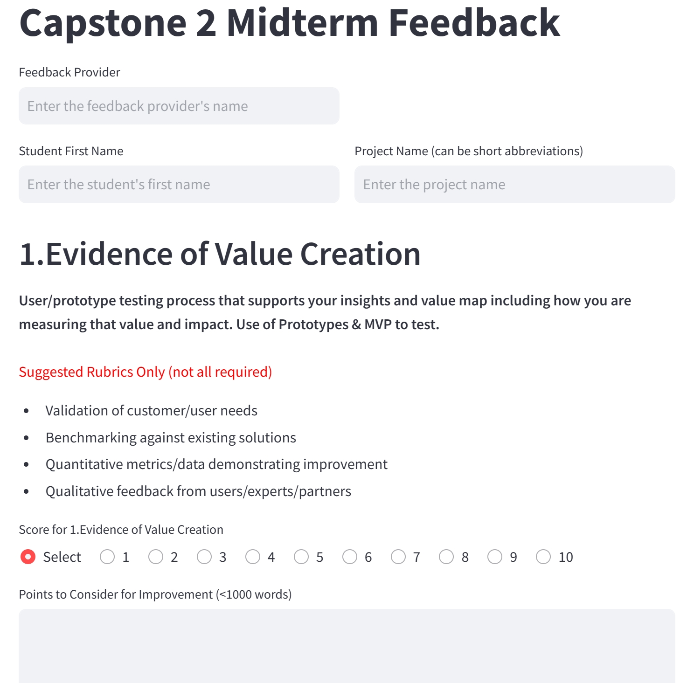

# CapstoneAssistant

## Project Overview
The purpose of this project is to help college students and instructors manage their Capstone projects more efficiently, streamlining the management, feedback and progress tracking progress. Main features include:

- AI transcription of student presentations and mentorship sessions (quality enhanced with student PPT submissions) (***under construction***)
- Digitalization of instructor feedback through app deployment with Streamlit (***capstonegrade.py***)
- AI summary of presentation content and instructor feedback for review (***under construction***)
- AI-generated (personalized) comment bank (under construction)
- Integration with organization/university email for one-click report submission (***under construction***)
- Progress and learning outcome tracker (***under construction***)


## Digitalization of Instructor Feedback

**Features**
- Multiple instructors can submit their reviews to students directly after the presentation
- Data saved to Google Spreadsheets for progress tracking and AI analysis
- Autofill student names for email after the feedback is generated
- Download the feedback form in pdf format to local computers
- App deployment through Streamlit


<br>**Add student data**
<br>Import your student name and email in JSON format to studentemail.json

```javascript
{
    "Nicole": {"full_name": "Nicole Wang", "email": "nicolewang@example.edu"},
    "Lucy": {"full_name": "Lucy Liu", "email": "lucyliu@example.com"}
}
```

<br>**Add Email and Google Spreadsheet keys**
<br>
<br>In order to send email from your email address, you need to acquire the App passwords. Details [here](https://support.google.com/mail/answer/185833?hl=en)]

<br>To upload the data once the forms are submitted, you need to acquire the API keys for sheets.googleapis.com. <br>
<br>Go to [Google Cloud Console](https://developers.google.com/workspace) and then enable both Google Drive API and Google Sheet API. Download the credentials, and then paste them into Streamlit Secrets (under "Settings") in TOML format.


<br>**Feedback Form Example**


